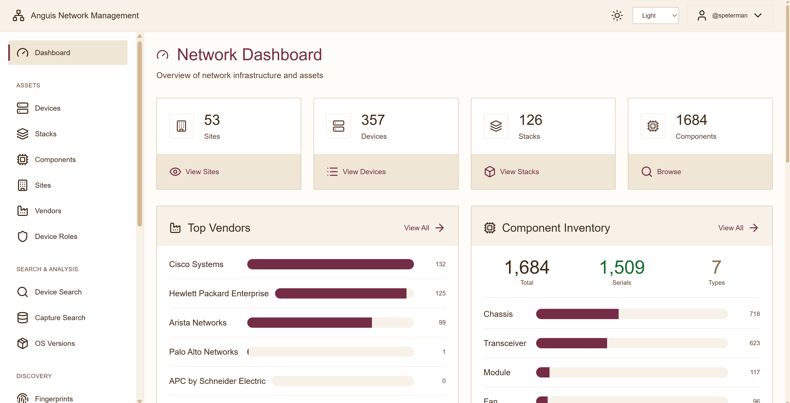
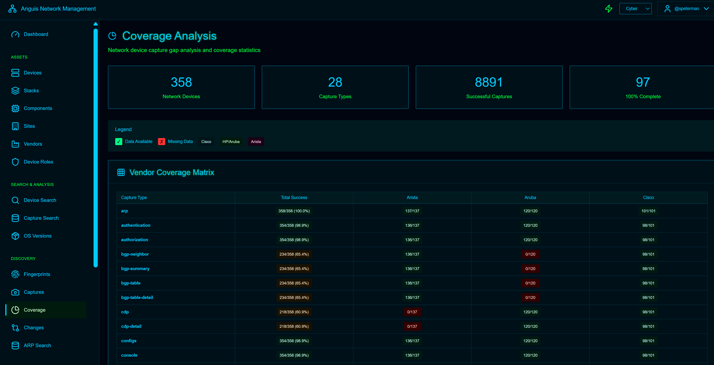
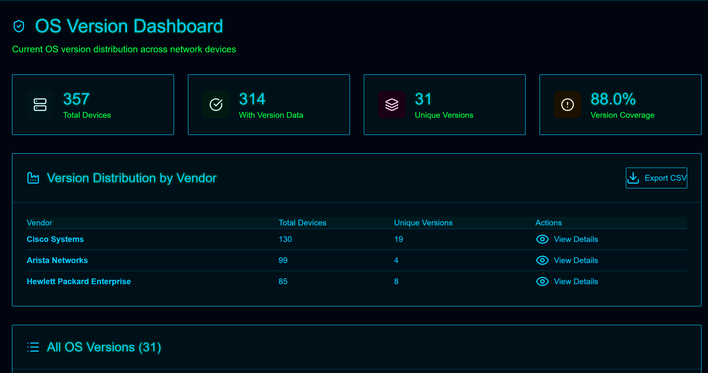
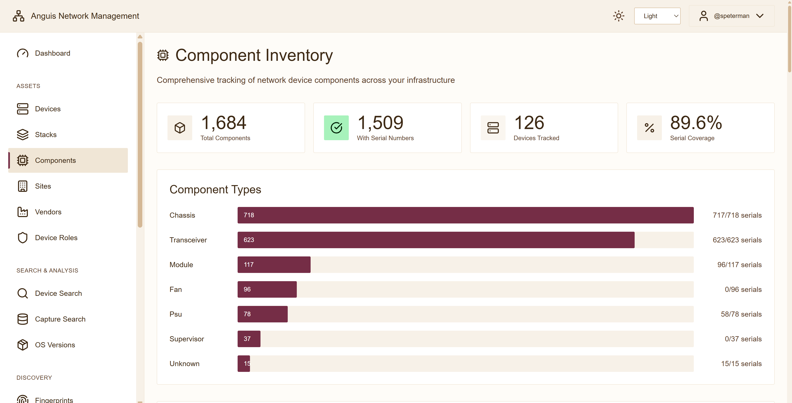
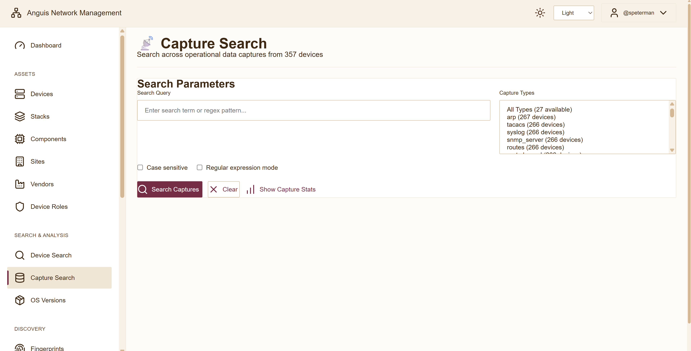
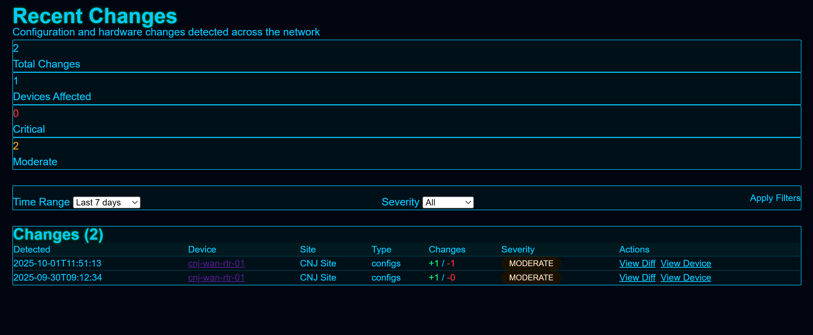
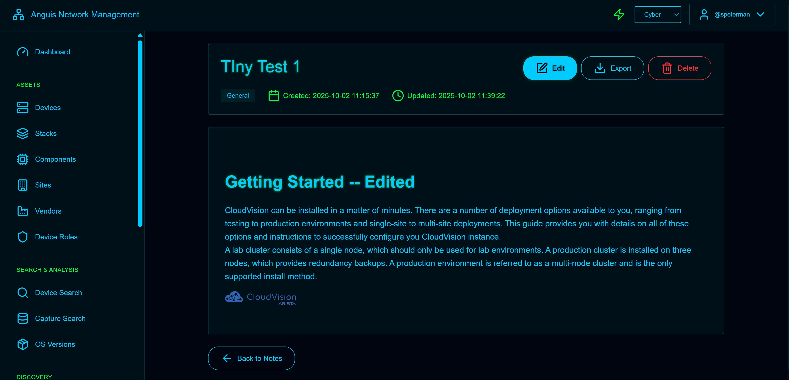

# Anguis Network Management System

Multi-vendor network automation platform for discovery, configuration tracking, and infrastructure visibility.



**Production Deployment:** 357 devices | 53 sites | 126 stacks | 1,684 components

---

## Status: Functional Beta (Single Deployment)

**Core Platform:**
- Network discovery, fingerprinting, and configuration tracking operational
- Web dashboard with 15 complete modules managing real infrastructure
- Component-level inventory tracking with 89.6% serial coverage
- Integrated documentation system treating operational knowledge as first-class data

**Limitations:**
- Single production deployment (author's network only)
- Manual workflow execution (no scheduler in main release)
- Windows-optimized (limited Linux/macOS testing)
- Breaking changes possible during beta refinement

**Release Context:** Establishing prior art before employment transition (October 2025)

---

## Quick Start

### Installation
```bash
git clone https://github.com/scottpeterman/anguisnms
cd anguisnms
python -m venv .venv
.venv\Scripts\activate  # Windows
pip install -r requirements.txt
python db_init.py
python arp_cat_init_schema.py
```

### Launch Dashboard
```bash
cd app
python run.py
# Access at http://localhost:8086
# Authentication: OS credentials (Windows/PAM/LDAP)
```

---

## Architecture Overview

Anguis integrates proven components into a unified platform for network operations:

**Foundation Projects:**
- **[Secure Cartography](https://github.com/scottpeterman/secure_cartography)** (134 ⭐, 21 forks) - CDP/LLDP discovery engine
- **[TerminalTelemetry](https://github.com/scottpeterman/terminaltelemetry)** - SSH automation patterns
- **[TermTelent](https://github.com/scottpeterman/termtelent)** - Enterprise management workflows
- **[VelociTerm](https://github.com/scottpeterman/velociterm)** - Web terminal framework

**Novel Contributions:**
- Database schema with dual-database architecture (assets + ARP tracking)
- Configuration change detection with content hashing and severity classification
- Component normalization with TextFSM template scoring across vendors
- Integrated knowledge system with wiki-style documentation linked to infrastructure
- Documentation-as-code topology pipeline (JSON → GraphML/DrawIO/SVG)

**Integration Layer (Beta Status):**
- Unified web interface combining all operational modules
- Multi-backend authentication (Windows/PAM/LDAP)
- Backup/restore utilities with integrity validation
- Data pipeline orchestrating discovery → fingerprinting → capture → database

---

## Screenshots

### Real-Time Operations

  
*Vendor coverage matrix - 8,891 successful captures across 28 types*

  
*Version compliance - 88% coverage, 314 devices tracked*

### Asset Intelligence

  
*Hardware tracking - 1,684 components, 89.6% serial coverage*

  
*Asset overview - 126 stacks, multi-vendor support*

### Operational Tools

  
*Full-text search with FTS5 across configurations*

  
*Configuration diff monitoring with severity classification*

  
*Integrated documentation with rich text and device associations*

---

## Feature Status

### Complete Modules (15)

**Asset Management**
- Devices - Full CRUD with filtering, bulk operations, CSV export
- Components - Hardware inventory (1,684 tracked)
- Stacks - 126 stacks managed (data accessible via device details)
- Sites/Vendors/Roles - Complete taxonomy management

**Data Collection**
- OS Versions - Compliance tracking with vendor breakdowns
- Capture Search - Full-text search across 8,891 files
- Coverage Analysis - Gap identification and success metrics
- ARP Search - MAC address lookup with vendor normalization

**Operations**
- Changes - Configuration diff monitoring
- Network Maps - Topology visualization (SVG/GraphML/DrawIO)
- Bulk Operations - Preview-commit workflow for batch modifications
- SSH Terminal - WebSocket-based live device access

**Documentation**
- Notes - Rich-text system with TinyMCE, internal linking, device associations
- Full-text search across notes and configurations
- Wiki-style `[[Note Title]]` syntax for knowledge graphs

**Infrastructure**
- Authentication - Multi-backend (Windows/PAM/LDAP)
- Backup/Restore - Complete lifecycle management with SHA256 validation

### Data Pipeline (Fully Functional)

**Discovery → Topology → Visualization**
```bash
# Automated network discovery via Secure Cartography
cd pcng
python sc_run3.py --username admin --password secret --workers 10

# Generate multiple visualization formats from topology
python sc_enhance_all_maps.py --svg-no-endpoints --workers 10
```

**Topology → Inventory Conversion**
```bash
# Convert discovered topology to device inventory
python map_to_session.py maps/site1/site1.json -o sessions.yaml
# Or merge multiple sites
python merge_to_session.py maps/ -o sessions.yaml
```

**Fingerprinting & Configuration Capture**
```bash
# Multi-process fingerprinting
python batch_spn_concurrent.py sessions.yaml --fingerprint-only --max-processes 8

# Configuration capture (28 types supported)
python batch_spn_concurrent.py sessions.yaml --fingerprinted-only \
    -c "show running-config" -o configs --max-processes 8
```

**Database Loading**
```bash
# Load fingerprints, captures, and extract components
python db_load_fingerprints.py --fingerprints-dir pcng/fingerprints
python db_load_captures.py --captures-dir pcng/capture
python inventory_loader.py
```

**Complete cycle:** ~4 hours for 357 devices (manual workflow)

### In Development (Unreleased)

**Real-Time Monitoring POC**
- SVG-based live status dashboards
- Multi-site concurrent monitoring with job orchestration
- Port connectivity testing (SSH/HTTP/HTTPS/custom)
- Automated snapshot history and status APIs
- YAML-defined job scheduling with parallel execution

This capability exists in POC form but requires additional testing before release.

---

## Technology Stack

**Proven Components (External Validation):**
- Secure Cartography - Network discovery (134 ⭐, 21 forks)
- Paramiko - SSH connectivity
- TextFSM - Multi-vendor parsing (100+ templates)
- NetworkX - Topology analysis

**Novel Implementations (Single Deployment):**
- SQLite with FTS5 full-text search
- Dual-database architecture (assets + ARP tracking)
- Flask dashboard with 15 integrated modules
- Change detection with content hashing
- Component normalization across vendors

**Visualization:**
- PyQt6 + WebEngine for SVG generation
- Mermaid diagrams for web rendering
- yEd GraphML and Draw.io format export

---

## Documentation-as-Code Architecture

The mapping pipeline treats network topology as versioned, executable documentation:

**Single Source of Truth:**
```
CDP/LLDP Discovery (Secure Cartography)
    ↓
JSON Topology (versioned in Git)
    ↓
Multiple Renderings:
  - GraphML (yEd - engineering detail)
  - DrawIO (collaborative editing)
  - SVG (web dashboards - clean view)
```

**Topology Analysis:**
- NetworkX calculates degree, betweenness, clustering
- Identifies core vs edge devices mathematically
- Metadata embedded in visualizations
- `--svg-no-endpoints` flag: Engineering detail vs executive summary from same source

**Why This Matters:**
- Diagrams generated from actual network state (CDP/LLDP)
- Version controlled (Git diff shows topology changes)
- Multiple expert-tool formats from one authoritative source
- No manual diagram updates - if it's in the network, it's in the diagram

---

## Integrated Knowledge System

The notes module treats operational documentation as infrastructure:

**Architecture:**
- TinyMCE WYSIWYG editor embedded in NMS
- Wiki-style internal linking: `[[Note Title]]` → resolved links
- Multi-entity associations (notes → devices AND sites)
- FTS5 full-text search across notes + configurations
- Image attachments with SVG sanitization

**Knowledge Graph:**
```
Notes ↔ Devices ↔ Components ↔ Configurations ↔ Changes
```

Search for "BGP peering" returns:
- Device configs with BGP commands
- Notes explaining design decisions
- Topology showing BGP relationships
- All from unified query

**Novel Integration:**
No commercial NMS combines rich-text documentation with asset relationships this way. Most use external wikis (Confluence) or plain text fields. This embeds operational knowledge directly in the infrastructure database.

---

## Production Metrics

Based on actual deployment (October 2025):

**Scale:**
- 357 devices managed
- 53 sites across infrastructure
- 126 switch stacks with component detail
- 1,684 hardware components inventoried
- 10,229 capture files (189 MB)
- 443 fingerprint files (3 MB)
- 262 network maps (130 MB)

**Coverage:**
- 88% OS version tracking
- 89.6% component serial numbers
- 8,891 successful captures
- 98.9% config backup (fingerprinted devices)

**Performance:**
- Discovery: 45-60 min (295 sites, proven by SC)
- Fingerprinting: 60-90 min (8 processes)
- Full cycle: ~4 hours (manual trigger)
- Dashboard: <500ms response
- Backup: 15-30 sec (58 MB compressed)

**Vendor Support (Tested):**
- Cisco IOS/IOS-XE/NX-OS: 132 devices
- Arista EOS: 197 devices
- HPE ProCurve/Aruba: 127 devices

---

## Risk Assessment

**Low Risk (Proven in Production):**
- Network discovery (Secure Cartography - external validation)
- SSH execution (TerminalTelemetry patterns - battle-tested)
- Multi-vendor parsing (TextFSM - community templates)

**Medium Risk (Novel Integration):**
- Flask module integration across 15 operational modules
- Multi-backend authentication switching
- Backup/restore at scale

**Higher Risk (Novel, Single Deployment):**
- Database schema evolution under load
- Change detection at high frequency
- Component extraction beyond Cisco/Arista/HPE
- Notes system at scale (tested with 6 notes)

**Untested:**
- Multi-user concurrent operations
- Networks >500 devices
- Vendors beyond primary three (Cisco/Arista/HPE)
- High-frequency change environments
- Migration/upgrade paths

---

## Requirements

**Minimum:**
- Python 3.8+ (developed on 3.12)
- 8GB RAM
- Windows 10/11, Linux, or macOS
- Network access to managed devices

**Recommended:**
- Python 3.12
- 16GB RAM
- Multi-core CPU (8+ for parallel processing)
- 50GB storage for 1 year of captures

**Platform Notes:**
- Windows: Primary development platform, extensively tested
- Linux: Functional, authentication tested
- macOS: Functional, limited testing

---

## Documentation

**21 comprehensive README files covering every component:**

### Core Workflows
- [Network Mapping](README_Map_pipeline.md) - Discovery and visualization
- [Data Pipeline](README_Pipeline.md) - Fingerprinting and capture
- [Component Inventory](README_Inventory_Components.md) - Hardware tracking
- [Backup & Restore](README_Backups.md) - Lifecycle management

### System Configuration  
- [Authentication](README_Auth.md) - Multi-backend setup
- [Database Schema](README.DB.md) - Design and ERD
- [Bootstrapping](README_Bootstrapping.md) - Initial setup

### Features
- [Web Dashboard](README_Network_Mgmt_Flask.md) - All 15 modules
- [Notes System](README_Notes.md) - Knowledge management
- [ARP Tracking](README_arp_cat.md) - MAC address management
- [Change Detection](README_Archive_change_detection.md) - Config monitoring
- [Fingerprinting](README_Fingerprinting.md) - Device identification

Plus: Database scaling, batch operations, SSH proxy, TextFSM templates, and more.

---

## Roadmap

**Near-Term (Active Development):**
- Real-time monitoring release (POC complete, needs testing)
- Automated scheduler for collection workflows
- Enhanced stack browser UI
- Settings GUI (currently YAML-only)

**Medium-Term (Planned):**
- Note versioning and history
- Advanced change analytics
- Multi-user collaboration features
- Expanded vendor support (Juniper, Palo Alto tested but limited)

**Long-Term (Vision):**
- Distributed monitoring across sites
- Predictive maintenance from component data
- API-first architecture for integrations
- GitOps workflow automation

---

## Project Context

Anguis is a **capstone integration** synthesizing lessons from four production projects:

**Foundation:**
- Secure Cartography provides proven discovery (134 ⭐, external users)
- Terminal frameworks provide SSH automation patterns
- Enterprise management informs workflow design

**Innovation:**
- Database schema design for network operations
- Change detection methodology
- Component normalization across vendors
- Documentation-as-code topology pipeline
- Knowledge system architecture

**Risk Profile:**
- Low risk: Proven discovery and SSH components
- Medium risk: Integration layer and web dashboard
- Higher risk: Novel database patterns and change detection at scale

This is integration testing of proven libraries, not alpha testing of novel code.

---

## Use Cases

**Good For:**
- Network teams wanting automation transparency
- Organizations building in-house tools
- Engineers learning modern network automation
- Teams needing integrated documentation + monitoring
- Establishing baseline before commercial tools

**Not Suitable For:**
- Mission-critical without extensive testing
- Teams requiring enterprise support
- GUI-only workflows (CLI/YAML configuration required)
- Immediate production deployment in new environments

---

## License

GNU General Public License v3.0 - See [LICENSE](LICENSE)

This software is free and open source. Contributions welcome.

---

## Related Projects

- [Secure Cartography](https://github.com/scottpeterman/secure_cartography) - Network discovery engine (required dependency)
- [TerminalTelemetry](https://github.com/scottpeterman/terminaltelemetry) - SSH automation framework
- [TermTelent](https://github.com/scottpeterman/termtelent) - Enterprise telemetry platform
- [VelociTerm](https://github.com/scottpeterman/velociterm) - Web-based terminal framework

---

*Functional Beta | October 2025*

**Status Summary:** Core platform operational with 357 devices in production. Discovery and SSH components externally validated. Integration layer and novel features tested in single deployment. Real-time monitoring exists in POC form. Documentation comprehensive. Breaking changes possible during beta.