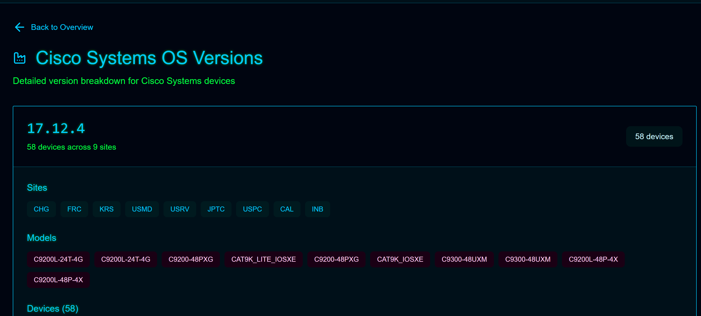
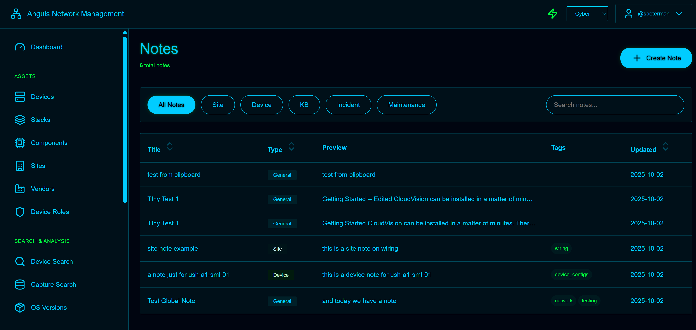

# Anguis

**Python-based network device discovery, inventory management, and configuration tracking system**


> ⚠️ **Alpha Release** - Functional but evolving. Released under GPLv3 prior to employment change. Expect rough edges and active development.

---

## What This Does

Anguis automates network infrastructure management through integrated discovery, fingerprinting, and web-based asset tracking:

- **Network Discovery** - CDP/LLDP topology mapping with parallel site processing
- **Device Fingerprinting** - TextFSM-based identification with 100+ vendor templates
- **Configuration Capture** - 31 operational data types across multi-vendor environments
- **Component Tracking** - Hardware inventory extraction and serial number management
- **Change Detection** - Configuration diff monitoring with unified viewer
- **Web Dashboard** - 11 operational modules for real-time visibility

**Tested Scale:**
- 455 devices across 53 sites
- 126 switch stacks
- 2,165 components tracked
- Multi-vendor: Cisco, Arista, HPE, F5, Juniper

---

## Screenshots

### Dashboard & Inventory

*Real-time network overview with vendor distribution and component tracking*


*Hardware component tracking - 2,165 items across chassis, modules, PSUs, fans, and transceivers*

### Search & Analysis

*Full-text search across 31 capture types with regex support and coverage analysis*


*Version compliance dashboard - 90.5% coverage across 412 devices*


*Drill-down view showing version distribution by vendor with device lists*


*Data collection gap identification with vendor-specific success rate matrices*

### Operations & Documentation

*Configuration change detection with unified diff viewer and severity classification*


*Integrated documentation with device/site associations and full-text search*


*Rich note editor with image support and tag-based organization*

---

## Quick Start

```bash
# Clone and setup
git clone https://github.com/scottpeterman/anguis
cd anguis
python -m venv .venv
source .venv/bin/activate
pip install -r requirements.txt

# Initialize
python db_init.py

# Discovery workflow
python sc_run3.py --username admin --password secret --workers 10
python enhance_all_maps.py --svg-no-endpoints --workers 10
python batch_spn_concurrent.py sessions.yaml --fingerprint-only
python batch_spn_concurrent.py sessions.yaml --fingerprinted-only
python db_load_fingerprints.py --fingerprints-dir fingerprints
python db_load_captures.py --captures-dir capture

# Launch web interface
cd app
python run.py
# Access at http://localhost:8086
```

---

## Architecture

```
Network Devices → Discovery (CDP/LLDP)
                ↓
         Topology JSON
                ↓
      Maps (SVG/GraphML/DrawIO)
                ↓
   Device Fingerprinting (TextFSM)
                ↓
 Configuration Capture (31 types)
                ↓
      SQLite Database
                ↓
   Flask Web Dashboard
```

**Pipeline Components:**

1. **sc_run3.py** - Parallel network discovery with site isolation
2. **enhance_all_maps.py** - Visual topology generation with vendor icons
3. **batch_spn_concurrent.py** - Multi-process fingerprinting and capture
4. **inventory_loader.py** - Component extraction from inventory captures
5. **arp_cat_loader.py** - MAC address tracking with vendor normalization
6. **Flask app** - Web-based management interface

---

## Web Dashboard Modules

**Operational (11 Complete):**
- Dashboard - Network overview and real-time metrics
- Devices - Full CRUD with filtering and export
- Components - Hardware inventory browser (2,165 items)
- OS Versions - Compliance tracking (90.5% coverage)
- Capture Search - Full-text configuration search
- Coverage Analysis - Data collection gap identification
- Changes - Configuration diff monitoring
- Network Maps - Topology visualization
- ARP Search - MAC address lookup (7,658 entries)
- SSH Terminal - Web-based live device access
- Bulk Operations - Safe batch modifications
- Notes - Integrated documentation system

**Features:**
- Multi-backend authentication (Windows/Linux/LDAP)
- CSV export across all modules
- WebSocket-based SSH sessions
- Preview-commit workflow for bulk changes
- Component-level inventory tracking
- Multi-vendor MAC normalization
- Full-text search with FTS5
- Rich text notes with image support

---

## Key Capabilities

### Discovery & Mapping
- Parallel site discovery (295 sites in 45-60 minutes)
- CDP/LLDP topology mapping
- SVG, GraphML, DrawIO export formats
- Automatic vendor icon integration
- yEd-compatible hierarchical layouts

### Data Collection
- TextFSM-based device fingerprinting
- 31 capture types (configs, inventory, ARP, routing, VLANs, etc.)
- Multi-vendor support (Cisco IOS/NX-OS, Arista EOS, HPE, Juniper)
- Parallel execution (8 concurrent processes)
- Success rates: 85%+ fingerprinting, 60-65% capture

### Component Inventory
- Automatic extraction from show inventory
- Tracks: Chassis, modules, PSUs, fans, transceivers
- Serial number coverage: 88%
- Multi-vendor templates (Cisco, Arista, HPE)
- 100% success on Cisco/Arista platforms

### ARP Tracking
- Multi-vendor MAC normalization (Cisco dot, HP dash, Arista colon)
- Historical timeline view
- 7,658 entries across 115 devices
- VRF/context awareness (default VRF currently)

---

## Performance Metrics

**Real-World Timings:**
- Discovery: 45-60 minutes (295 sites, 10 workers)
- Map Enhancement: 30-45 minutes (10 workers)
- Fingerprinting: 60-90 minutes (8 processes)
- Configuration Capture: 90-120 minutes (8 processes)
- Component Extraction: <3 seconds per device
- Dashboard Load: <500ms
- Export Generation: <2s for 455 devices

**Complete Cycle:** ~4 hours for full network refresh

---

## Documentation

Comprehensive documentation included:

- **[Maps Pipeline](README_Maps_Pipeline.md)** - Discovery and topology generation
- **[Data Pipeline](README_Pipeline.md)** - Fingerprinting and configuration capture
- **[Web Dashboard](README_Network_Mgmt_Flask.md)** - Flask application and modules
- **[Component Inventory](README_Inventory_Components.md)** - Hardware tracking system
- **[Authentication](README_Auth.md)** - Multi-backend auth (Windows/Linux/LDAP)

---

## Project Evolution

**2024:** Initial proof of concept with CDP/LLDP discovery and dual SNMP/SSH support

**2024-2025:** [Secure Cartography](https://github.com/scottpeterman/secure_cartography) - Production-scale parallel discovery engine (295 sites in 45-60 minutes)

**2025:** Anguis - Integrated platform combining discovery, fingerprinting, component tracking, and comprehensive web dashboard

---

## Requirements

- Python 3.8+
- Core: paramiko, pyyaml, networkx, textfsm
- Web: flask, flask-socketio, python-socketio
- Optional: secure_cartography, Pillow
- Platform-specific: pywin32 (Windows), python-pam (Linux), ldap3 (LDAP)

See `requirements.txt` for complete dependencies.

---

## Installation Notes

**Database Initialization:**
```bash
python db_init.py              # Main assets database
python arp_cat_init_schema.py  # ARP tracking database
```

**Configuration:**
- Create `config.yaml` from `config.yaml.example`
- Configure authentication backend (local/LDAP)
- Set credential management for discovery/capture
- See `README_Auth.md` for authentication setup

**First Run:**
```bash
cd app
python run.py
# Default credentials: admin / admin (local auth)
```

---

## Alpha Status Notes

This release establishes prior art before employment change. While functional in production environments, expect:

- Ongoing refinement of UI/UX
- Additional vendor template development
- Enhanced error handling and logging
- Performance optimization for large deployments

Core functionality is stable and tested. The platform successfully manages 455 devices across 53 sites with multi-vendor support.

---

## License

GNU General Public License v3.0

This program is free software: you can redistribute it and/or modify it under the terms of the GNU General Public License as published by the Free Software Foundation, either version 3 of the License, or (at your option) any later version.

See [LICENSE](LICENSE) for details.

---

## Related Projects

- [Secure Cartography](https://github.com/scottpeterman/secure_cartography) - Network discovery engine
- [Velociterm](https://github.com/scottpeterman/velociterm) - SSH terminal framework

---

*Alpha Release | October 2025 | scottpeterman*
